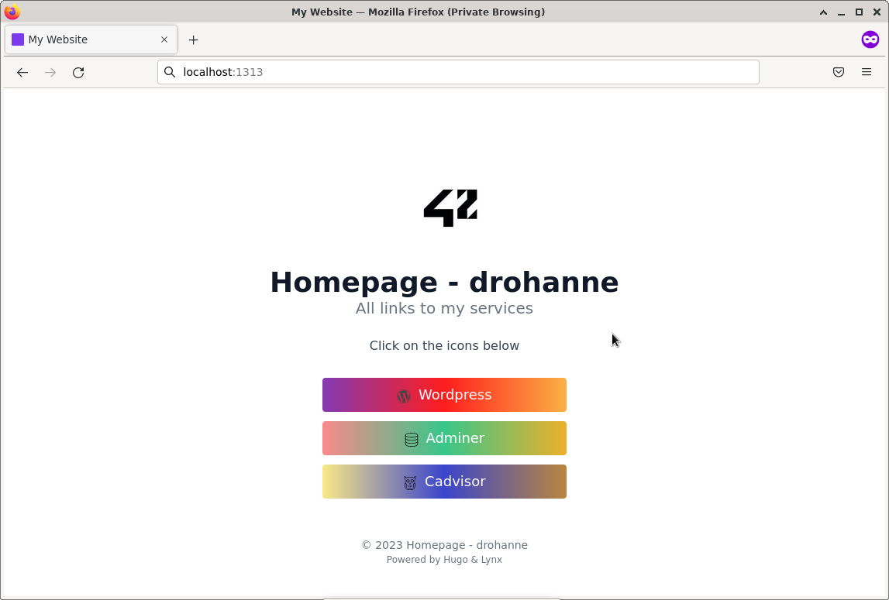

# Dockerized Microservices Playground

This project aims to broaden your knowledge of system administration by using Docker. Each Docker image has the same name as its corresponding service (and the base image is always Debian).

---
## Docker containers
The project consists of 8 containers:
- [**MariaDB**](https://mariadb.org/) database for Wordpress.
- [**Wordpress**](https://wordpress.org/) **+** [**php-fpm**](https://www.php.net/manual/en/install.fpm.php) - personal blog.
- [**Redis**](https://redis.io/) for caching Wordpress.
- [**Adminer**](https://www.adminer.org/) for managing content in MariaDB database.
- [**Nginx**](https://www.nginx.com/) - web server for Wordpress. It works on 443 port (https) with self-signed certificate.
- [**cAdvisor**](https://github.com/google/cadvisor) analyzes resource usage and performance characteristics of running containers.
- [**FTP server (vsftpd)**](https://security.appspot.com/vsftpd.html) container pointing to the volume of the WordPress website.
- [**Hugo**](https://gohugo.io/) is open-source static site generators. This is a site for links to my services.

---
## Usage
Before you start using the service, you need to add to the /etc/hosts file 
`drohanne.42.fr`:
```bash
127.0.0.1       localhost drohanne.42.fr
```

Afterwards, just type the `make` command.

After that, enter `localhost:1313` in the address bar.



To test **ftp-server** you can use [**FileZilla**](https://filezilla-project.org/) using `port = 21` these credentials:
```
FTP_USER=ftpuser
FTP_PASS=ftppass
```
